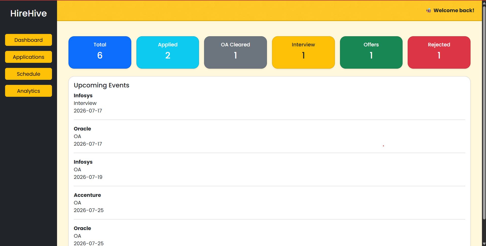
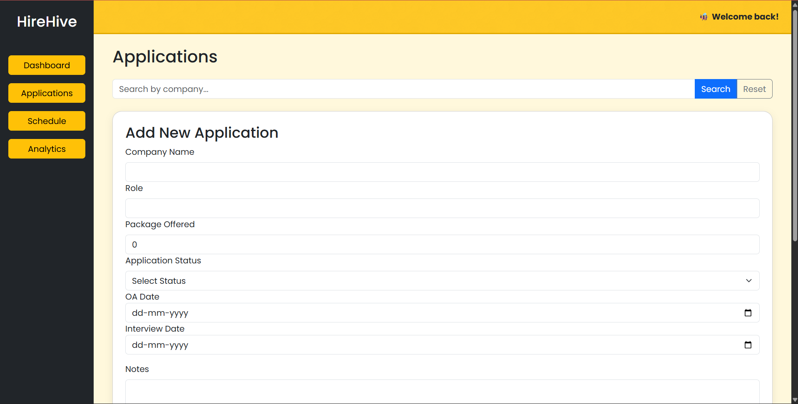
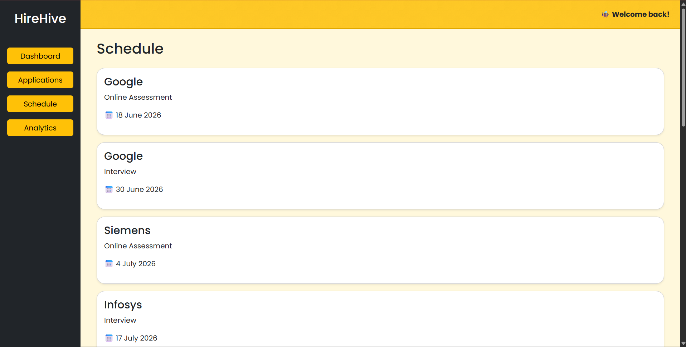
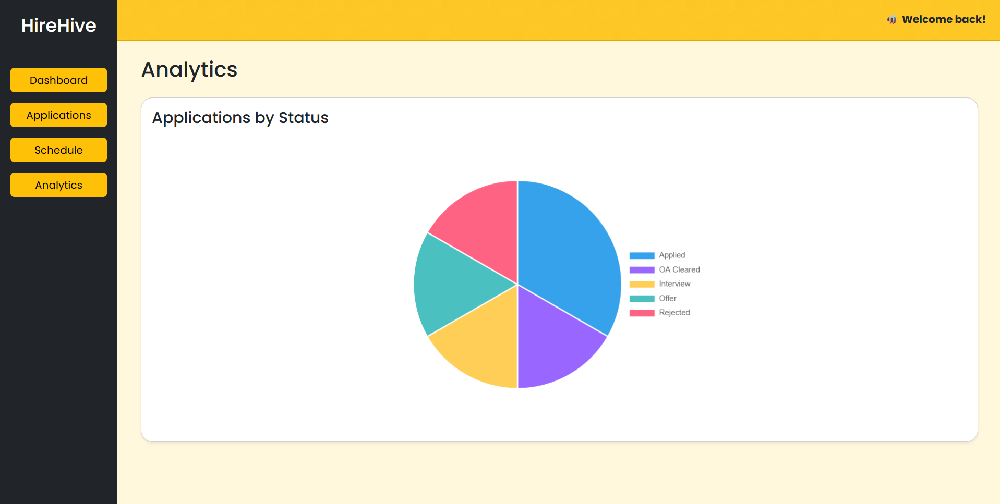

HIREHIVE
A full-stack Placement Management Platform built using React, Spring Boot, and MySQL.

FEATURES
1) Track placement applications
2) Search applications by company
3) Edit application details
4) Delete applications
5) Schedule Online Assessments & Interviews
6) Dashboard with live statistics
7) Analytics using interactive Pie Charts

TECH STACK
- FRONTEND
  React
  Axios
  Bootstrap
  React Router
  Chart.js

- BACKEND
  Spring Boot
  Spring Data JPA
  Hibernate

- DATABASE
  MySQL
  
SCREENSHOTS

FUTURE IMPROVEMENTS
1) User Authentication
2) AI Interview Preparation Assistant
3) Email Reminders
4) LeetCode Progress Integration
5) Advanced Analytics Dashboard

AUTHOR
Aakanksha A Dutt
